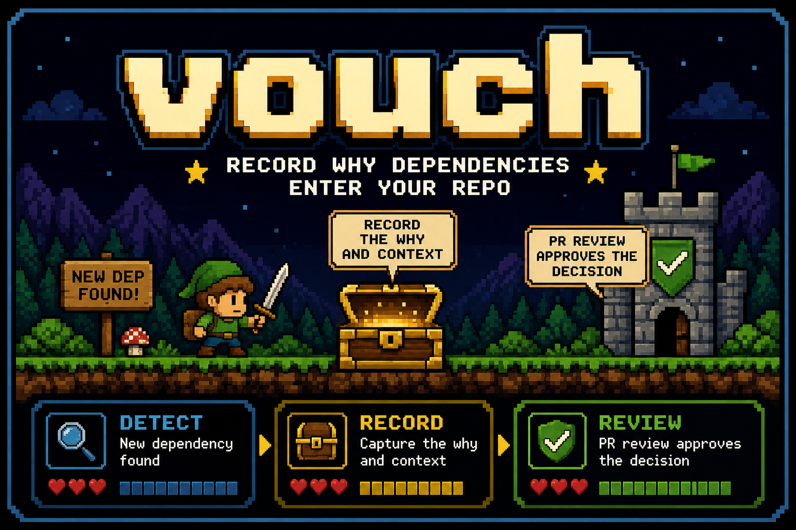

# vouch



A **dependency-decision ledger** for Node.js projects and coding agents.

> It doesn't prevent the bypass. It makes the bypass **impossible to hide.**

`vouch` doesn't decide whether a dependency is safe. It makes sure every dependency that
enters your repo was **recorded, explained, and reviewable in the pull request** — a memory
and conscience for your `package.json`.

---

## Contents

- [The idea](#the-idea)
- [What you'll see](#what-youll-see)
- [Quick start](#quick-start)
- [How it works](#how-it-works)
- [vouch records; the PR review approves](#vouch-records-the-pr-review-approves)
- [When `check` blocks on a CVE](#when-check-blocks-on-a-cve)
- [Commands](#commands)
- [Configuration](#configuration-safe-depjson)
- [For coding agents](#for-coding-agents)
- [What it is *not*](#what-it-is-not)

---

## The idea

1. **Every dependency is a decision.** Adding one should be recorded — with who and why —
   not slipped into a lockfile diff nobody reads.
2. **The record lives in your repo.** Decisions go into a committed ledger
   (`.security/dependency-approvals.json`), visible in the PR diff and auditable forever.
3. **The record stays honest over time.** When a dependency you recorded later gains a known
   advisory, or its version drifts from what was reviewed, CI surfaces it until a human
   re-decides.

---

## What you'll see

A dependency added without `vouch` fails CI:

```text
✦ vouch  Dependency review failed

  - axios: missing ledger entry

  Next:
    vouch <package>
```

Adding one with `vouch` records the decision (and blocks risky packages until you say why):

```text
✦ vouch  Dependency needs review

  esbuild@0.28.0
  - install-time script detected: postinstall

  Next:
    vouch esbuild --force-with-reason "<why this dependency is needed>"
```

Once recorded, the ledger entry travels with the diff and CI is green:

```text
✦ vouch  Dependency review passed

  All dependencies are recorded.
```

---

## Quick start

**Requirements:** Node.js 18+. No other dependencies.

**Install** — run on demand with `npx`, or install the CLI globally:

```bash
npx vouch --help          # no install
npm install -g vouch      # or install the `vouch` command
```

**Add a dependency** — instead of `npm install` / `pnpm add`, run:

```bash
vouch some-package        # reviews, installs, and records the decision
vouch some-package -D     # devDependency
```

**Gate it in CI** — add one step that fails the build on any unrecorded dependency. Drop this
in `.github/workflows/vouch.yml` (also in [`examples/github-actions-check.yml`](examples/github-actions-check.yml)):

```yaml
name: vouch
on: [pull_request]
jobs:
  vouch:
    runs-on: ubuntu-latest
    steps:
      - uses: actions/checkout@v4
      - uses: actions/setup-node@v4
        with: { node-version: 20 }
      - run: npx vouch check
```

That's it. A raw `npm install <pkg>` (by a human *or* an agent) can no longer reach `main`
unrecorded. A fresh clone is unaffected — `npm install` / `npm ci` restores the lockfile as
usual, and `check` passes because the committed ledger already covers every dependency.

---

## How it works

**When you add a package** (`vouch <pkg>`):

1. Reviews it: **version age** and **install-time scripts** (blocked by default).
2. Warns you **right then** if the version already has a **known CVE** — so `check` is never
   the first messenger.
3. Installs it and records the decision (version, risk, who added it and why) in the ledger.

**In CI** (`vouch check`) — three states per dependency: *recorded* (ok), *unrecorded*
(blocked), or *needs review* (blocked). It fails when:

- a dependency in `package.json` has **no ledger entry** — added without `vouch`;
- a dependency **gained a CVE** that no human has acknowledged;
- a **high-risk** entry has **no `reason`** recorded for the reviewer to judge;
- **version drift** — a recorded version no longer satisfies the `package.json` range
  (`versionDrift`: `"warn"` by default, `"block"`, or `"off"`; direct deps, compared against
  the range, no lockfile);
- **pinning** — an opt-in `requirePinned` (`"warn"`/`"block"`, default `"off"`) flags deps
  that use a range instead of an exact version, suggesting the recorded version to pin to.

---

## vouch records; the PR review approves

This distinction is the heart of the tool:

- **vouch records a decision.** The ledger entry — who added it (`addedBy`, from `git config`),
  why (`reason`), at what version and risk — is *attribution*. It's self-asserted, not by
  itself an authorization.
- **The PR/MR review is the authorization.** A human approving the pull request, with the
  ledger entry visible in the diff, is the act that approves. vouch makes the decision
  conscious and reviewable; it doesn't try to verify or replace that review.

You can always force a thing through with `--force-with-reason`. You can never do it
*invisibly* — the reason and your identity land in the committed ledger, in front of the
reviewer. See [`docs/threat-model.md`](docs/threat-model.md) for what vouch does and does not
defend.

---

## When `check` blocks on a CVE

A block isn't damage — it's a pause: *something about a dependency you recorded changed.* Three
honest options, in order of preference:

1. **Fix it** — `vouch <pkg>@<patched-version>` to record a fixed release.
2. **Remove or replace it** — drop the dependency, or swap in a lighter one.
3. **Accept it knowingly** — once you've judged the risk acceptable (dev-only, unreachable
   code path, no fix yet), `vouch acknowledge <pkg> --reason "<why this is acceptable>"`.

`acknowledge` re-queries advisories for the recorded version and records the acknowledged set,
who acknowledged it (from `git config`), why, and when — visible in the PR diff. It refuses to
write while offline (we never record an acknowledgement we couldn't verify), and it blocks only
on a CVE it **confirmed**: offline or a stalled endpoint fails *open* (a warning, never a failed
build), and only the specific dependency that drifted — never your whole project.

---

## Commands

| Command | What it does |
|---|---|
| `vouch <pkg> [-D]` | Review, install, and record a dependency (`-D` for devDependencies). |
| `vouch <pkg> --force-with-reason "<why>"` | Override a block, recording the reason in the ledger. |
| `vouch check` | CI gate: fail on unrecorded deps, unexplained high-risk, CVE drift, or version drift. |
| `vouch acknowledge <pkg> --reason "<why>"` | Knowingly accept a dependency's current advisories (CVE drift). |
| `vouch --help` · `vouch --version` | Help (with the wordmark) and version. |

Environment: `YSNA_ADVISORY_URL` overrides the npm advisory endpoint (for enterprise mirrors/proxies).

---

## Configuration (`.safe-dep.json`)

All optional; sensible defaults apply.

```json
{
  "minimumVersionAgeHours": 24,
  "warnVersionAgeHours": 168,
  "blockInstallScripts": true,
  "requireCooldownConfigured": false,
  "versionDrift": "warn",
  "requirePinned": "off",
  "allowScopedPackages": ["@your-org/*"],
  "packageManager": "auto"
}
```

---

## For coding agents

`AGENTS.md` tells agents to use `vouch` instead of raw installs, to explain *why* a dependency
is needed before adding it, and — crucially — **not** to silence the gate on a human's behalf.
As agents add more dependencies, the ledger becomes the place a human reviews those decisions,
asynchronously and accountably.

---

## What it is *not*

Not a scanner. Deep per-package analysis (typosquatting, behavioral) is the job of tools like
`npq` and Socket. We don't *scan* for CVEs to discover them — we record the advisory posture of
what you recorded and flag **drift** after the fact. `vouch` owns **provenance and enforcement**.

## Zero dependencies

`"dependencies": {}`. Built on Node 18+ built-ins. A dependency-security tool with no
dependencies of its own.
